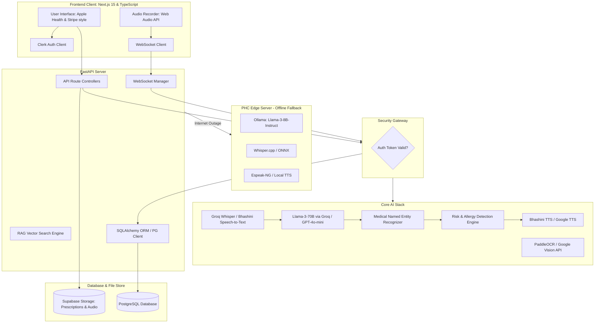

# MediLingua AI - System Architecture & Tech Design

**MediLingua AI** is a production-grade AI Medical Communication Assistant designed to eliminate language barriers between doctors and patients in India. This document serves as the master architectural blueprint for Phase 1.

---

## 1. System & AI Pipeline Diagram



---

## 2. Directory Structure

Below is the directory layout representing a production-ready monorepo structure.

```
d:\ideas\india runs/
├── README.md                   # Setup guide, run commands, tech specifications
├── docker-compose.yml          # Local PostgreSQL & edge services docker setup
├── .gitignore                  # Git exclude patterns
├── docs/                       # Comprehensive documentation
│   ├── architecture.md         # [THIS FILE] System & AI design details
│   ├── database_schema.sql     # SQL DDL schemas for migrations
│   ├── pitch_deck.md           # Investor presentation slides & data
│   └── judge_qa.md             # Winning Q&A strategies & responses
├── backend/                    # FastAPI Backend Service
│   ├── Dockerfile              # Docker recipe for backend API container
│   ├── requirements.txt        # Backend dependencies
│   ├── main.py                 # FastAPI app initialization & middlewares
│   ├── config.py               # Env configuration (Supabase, Clerk, Groq, OpenAI)
│   ├── db.py                   # SQLAlchemy engine & session initialization
│   ├── schemas.py              # Pydantic schemas for verification
│   ├── ai_engine.py            # AI Engine (Whisper STT, LLM Orchestration, RAG, TTS, OCR)
│   ├── api/                    # API Route Handlers
│   │   ├── __init__.py
│   │   ├── auth.py             # Clerk sync & user routes
│   │   ├── patients.py         # Patient CRUD & history routes
│   │   ├── consultations.py   # Consultation session routes & summarization
│   │   ├── translations.py    # Text/Speech translation & audio routing
│   │   ├── reminders.py        # WhatsApp/SMS schedule routes
│   │   ├── hospitals.py        # Google Maps integration (Nearby PHCs/Hospitals)
│   │   └── emergency.py        # SOS detection & hospital alerts
│   └── services/               # Internal business logic
│       ├── __init__.py
│       ├── bhashini.py         # Govt. of India Bhashini API integration
│       ├── supabase_store.py   # Audio & image file management
│       └── twilio_sms.py       # WhatsApp & SMS notification client
├── frontend/                   # Next.js 15 App Client
│   ├── package.json            # Node.js dependencies
│   ├── tsconfig.json           # TypeScript configuration
│   ├── tailwind.config.ts      # Custom Tailwind styling & brand color tokens
│   ├── next.config.ts          # Next.js build-time configurations
│   ├── src/
│   │   ├── app/                # App Router Structure
│   │   │   ├── layout.tsx      # Root design layout with Theme & Clerk providers
│   │   │   ├── page.tsx        # Brand Landing page & system gateway
│   │   │   ├── login/page.tsx  # Clerk Login page
│   │   │   ├── register/page.tsx # Clerk Registration page
│   │   │   ├── dashboard/page.tsx # Doctor & PHC Dashboard overview
│   │   │   ├── translate/page.tsx # Live Voice-to-Voice Translator component
│   │   │   ├── history/page.tsx # Searchable patient medical history
│   │   │   ├── consultation/[id]/page.tsx # Active session & summary display
│   │   │   ├── prescription/[id]/page.tsx # OCR Prescriptions & translated voice warnings
│   │   │   ├── reminders/page.tsx # Medicine reminder configuration panel
│   │   │   ├── hospitals/page.tsx # Google Maps dashboard for local PHCs
│   │   │   ├── emergency/page.tsx # Real-time emergency detection logs
│   │   │   ├── analytics/page.tsx # Rich graphs, charts, and metrics dashboard
│   │   │   ├── admin/page.tsx    # Admin configuration panel
│   │   │   └── settings/page.tsx # Language and device settings
│   │   ├── components/         # Reusable Component Library
│   │   │   ├── ui/             # Shadcn-UI primitives (Button, Dialog, Card)
│   │   │   ├── layout/         # Sidebar, Navbar, and Footer
│   │   │   ├── translate/      # Translation modules (Waveform, LanguageSelect)
│   │   │   └── dashboard/      # Metrics cards, patient list views
│   │   ├── lib/                # Utility modules
│   │   │   ├── api.ts          # Axios / Fetch client wrapping backend endpoints
│   │   │   ├── supabase.ts     # Supabase browser client
│   │   │   └── utils.ts        # Tailwind merge & styling helpers
│   │   └── hooks/              # Custom React hooks
│   │       ├── use-speech.ts   # Audio recording & websocket stream hook
│   │       └── use-websocket.ts # Websocket reconnect & status tracker
└── demo/                       # High-Fidelity Standalone Demo
    └── index.html              # Interactive client prototype for quick presentation
```

---

## 3. Database Schema (PostgreSQL)

The relational schema ensures data integrity, audit logs for clinical safety, and indexing for fast patient search.

### `hospitals`
Stores healthcare facilities (hospitals, Primary Health Centers, private clinics).
```sql
CREATE TABLE hospitals (
    id UUID PRIMARY KEY DEFAULT gen_random_uuid(),
    name VARCHAR(255) NOT NULL,
    type VARCHAR(50) NOT NULL, -- 'PHC', 'Ambulance', 'District Hospital', 'Clinic'
    address TEXT NOT NULL,
    latitude DOUBLE PRECISION,
    longitude DOUBLE PRECISION,
    phone_number VARCHAR(20),
    created_at TIMESTAMP WITH TIME ZONE DEFAULT CURRENT_TIMESTAMP
);
```

### `users` (Doctors, PHC Workers)
Stores medical practitioners authenticated via Clerk.
```sql
CREATE TABLE users (
    id VARCHAR(255) PRIMARY KEY, -- Clerk User ID (e.g., 'user_2N...')
    email VARCHAR(255) UNIQUE NOT NULL,
    first_name VARCHAR(100),
    last_name VARCHAR(100),
    role VARCHAR(50) NOT NULL, -- 'Doctor', 'Nurse', 'Rural Health Worker', 'Admin'
    hospital_id UUID REFERENCES hospitals(id) ON DELETE SET NULL,
    preferred_language VARCHAR(50) DEFAULT 'English',
    is_active BOOLEAN DEFAULT TRUE,
    created_at TIMESTAMP WITH TIME ZONE DEFAULT CURRENT_TIMESTAMP
);
```

### `patients`
Stores demographic, chronic conditions, and allergy records essential for risk detection.
```sql
CREATE TABLE patients (
    id UUID PRIMARY KEY DEFAULT gen_random_uuid(),
    full_name VARCHAR(255) NOT NULL,
    date_of_birth DATE NOT NULL,
    gender VARCHAR(20) NOT NULL,
    blood_group VARCHAR(5),
    chronic_conditions TEXT[], -- e.g., ['Hypertension', 'Diabetes Type-2']
    known_allergies TEXT[], -- e.g., ['Penicillin', 'Sulfa drugs']
    pregnancy_status BOOLEAN DEFAULT FALSE,
    primary_language VARCHAR(50) NOT NULL, -- e.g., 'Tamil'
    phone_number VARCHAR(15),
    created_at TIMESTAMP WITH TIME ZONE DEFAULT CURRENT_TIMESTAMP
);
```

### `consultations`
Stores every visit, live translations, audio logs, and generated clinical SOAP notes.
```sql
CREATE TABLE consultations (
    id UUID PRIMARY KEY DEFAULT gen_random_uuid(),
    patient_id UUID NOT NULL REFERENCES patients(id) ON DELETE CASCADE,
    doctor_id VARCHAR(255) NOT NULL REFERENCES users(id) ON DELETE RESTRICT,
    patient_language VARCHAR(50) NOT NULL, -- Tamil, Telugu, etc.
    doctor_language VARCHAR(50) NOT NULL,  -- English, Hindi, etc.
    status VARCHAR(50) DEFAULT 'Active',   -- 'Active', 'Completed', 'Emergency'
    audio_log_url TEXT,                     -- Supabase storage link to full audio file
    soap_summary JSONB,                    -- Structured SOAP schema: {subjective: "", objective: "", assessment: "", plan: ""}
    created_at TIMESTAMP WITH TIME ZONE DEFAULT CURRENT_TIMESTAMP
);
```

### `transcription_logs`
Stores line-by-line real-time translation items for UI rendering and SOAP summary generation.
```sql
CREATE TABLE transcription_logs (
    id UUID PRIMARY KEY DEFAULT gen_random_uuid(),
    consultation_id UUID NOT NULL REFERENCES consultations(id) ON DELETE CASCADE,
    sender VARCHAR(10) NOT NULL, -- 'Patient' or 'Doctor'
    original_text TEXT NOT NULL,
    translated_text TEXT NOT NULL,
    audio_translation_url TEXT,  -- URL to voice-cloned/TTS translation file
    is_risk_detected BOOLEAN DEFAULT FALSE,
    created_at TIMESTAMP WITH TIME ZONE DEFAULT CURRENT_TIMESTAMP
);
```

### `prescriptions`
Stores digital and scanned prescriptions, OCR parsed items, and dosage guidelines.
```sql
CREATE TABLE prescriptions (
    id UUID PRIMARY KEY DEFAULT gen_random_uuid(),
    consultation_id UUID REFERENCES consultations(id) ON DELETE SET NULL,
    patient_id UUID NOT NULL REFERENCES patients(id) ON DELETE CASCADE,
    doctor_id VARCHAR(255) REFERENCES users(id),
    scanned_image_url TEXT, -- If uploaded via handwritten OCR
    ocr_raw_text TEXT,
    medicines JSONB NOT NULL, -- Array of objects: [{name: "Paracetamol", dosage: "1-0-1", duration: "5 days", explanation: "Tamil text"}]
    risk_warnings TEXT[],     -- Flags like ['Allergy warning: Penicillin detected', 'Pregnancy risk']
    created_at TIMESTAMP WITH TIME ZONE DEFAULT CURRENT_TIMESTAMP
);
```

### `reminders`
Tracks automated regional language voice, SMS, or WhatsApp reminders configured for patients.
```sql
CREATE TABLE reminders (
    id UUID PRIMARY KEY DEFAULT gen_random_uuid(),
    patient_id UUID NOT NULL REFERENCES patients(id) ON DELETE CASCADE,
    prescription_id UUID REFERENCES prescriptions(id) ON DELETE CASCADE,
    medicine_name VARCHAR(255) NOT NULL,
    dosage_time TIME NOT NULL,
    reminder_type VARCHAR(20) NOT NULL, -- 'WhatsApp', 'SMS', 'Voice Call'
    language VARCHAR(50) NOT NULL,      -- Language of reminder
    status VARCHAR(20) DEFAULT 'Active', -- 'Active', 'Paused', 'Completed'
    created_at TIMESTAMP WITH TIME ZONE DEFAULT CURRENT_TIMESTAMP
);
```

### `emergency_alerts`
Logs and tracks emergency alerts triggered during active consultations.
```sql
CREATE TABLE emergency_alerts (
    id UUID PRIMARY KEY DEFAULT gen_random_uuid(),
    consultation_id UUID REFERENCES consultations(id) ON DELETE CASCADE,
    patient_id UUID REFERENCES patients(id),
    hospital_id UUID REFERENCES hospitals(id),
    trigger_keyword VARCHAR(255) NOT NULL, -- 'Chest pain', 'Breathing difficulty'
    status VARCHAR(20) DEFAULT 'Triggered', -- 'Triggered', 'Acknowledged', 'Resolved'
    created_at TIMESTAMP WITH TIME ZONE DEFAULT CURRENT_TIMESTAMP
);
```

---

## 4. API Specification (FastAPI REST & WebSocket)

All responses will be in standard JSON. Token-based authentication checks Clerk's JSON Web Keys (JWKS).

### Authentication & Users
* **`POST /api/v1/auth/sync`**
  - **Description**: Webhook triggered by Clerk on sign-up to write/sync user data to the PostgreSQL database.
  - **Response**: `200 OK` with synced user details.

* **`GET /api/v1/users/me`**
  - **Description**: Returns currently logged-in doctor/health worker profile.
  - **Headers**: `Authorization: Bearer <clerk_jwt>`

### Patient Management
* **`POST /api/v1/patients`**
  - **Description**: Create a new patient profile.
  - **Payload**: JSON matching `patients` database fields.
  - **Response**: `201 Created` with UUID.

* **`GET /api/v1/patients/search?query=name_or_phone`**
  - **Description**: Fast search for existing patients in the clinic.
  - **Response**: JSON array of matching patient profiles.

### Active Consultations (Live Translator)
* **`POST /api/v1/consultations/start`**
  - **Description**: Initialize a consultation session. Set doctor and patient languages.
  - **Payload**: `{ "patient_id": "UUID", "patient_language": "Tamil", "doctor_language": "English" }`
  - **Response**: `201 Created` with session `id`.

* **`WS /api/v1/consultations/stream/{id}`**
  - **Description**: Two-way WebSocket connection for real-time translation.
  - **Client sends**: Audio chunk (PCM/WebM) or text.
  - **Server sends**: JSON message with transcription, translation, and binary/link for TTS audio, along with risk flags.

* **`POST /api/v1/consultations/{id}/end`**
  - **Description**: Ends the consultation. Triggers the AI pipeline to analyze the transcript logs and generate a structured SOAP clinical summary.
  - **Response**: `200 OK` with JSON SOAP summary.

### OCR & Prescriptions
* **`POST /api/v1/prescriptions/ocr`**
  - **Description**: Post a scanned handwritten prescription to extract medicines.
  - **Payload**: Multi-part Form Data (`file: image`).
  - **Response**: Structured JSON containing extracted medicines, dosages, simplified explanations, and allergy/risk warnings.

### Reminders & Alerts
* **`POST /api/v1/reminders/schedule`**
  - **Description**: Schedules automated reminders.
  - **Payload**: `{ "patient_id": "UUID", "prescription_id": "UUID", "channels": ["WhatsApp", "SMS"] }`

* **`POST /api/v1/emergency/sos`**
  - **Description**: Trigger an immediate ambulance / emergency alert to the nearest hospital.
  - **Payload**: `{ "consultation_id": "UUID", "coordinates": { "lat": 12.9716, "lng": 77.5946 } }`

---

## 5. Core AI Workflow Pipeline

The translation workflow operates as an event-driven loop inside the FastAPI WebSockets:

```
[Patient Audio Input (Tamil)]
      │
      ▼ (WebSocket stream chunks)
[STT: Groq Whisper-large-v3-turbo] ──► Generates Tamil Transcript
      │
      ▼ (Pass transcript to LLM)
[LLM: Llama-3-70B Prompt]
      ├── Translate Tamil to English
      ├── Recognize Medical Entities (symptoms, drugs, dosage)
      └── Detect Risks (Allergy lookup, pregnancy, drug conflicts)
      │
      ├───► [If Emergency Keyword Detected] ──► Trigger SOS System Alert
      │
      ▼
[Generated English Translation] ──► Send to Doctor Screen
      │
      ▼ (Trigger TTS in parallel)
[TTS: AI4Bharat / Google Text-to-Speech] ──► Generate English Audio (Doctor ears)
```

### The Prompt Design for Medical translation & Risk Check
To ensure translation is clinical-grade, the LLM prompt injects:
- **Patient Metadata**: Allergies, pregnancy status, and chronic diseases.
- **Context Injection**: Medical context constraints (do not translate "paracetamol" to generic terms, keep dosage frequencies standard).
- **Safety Guard**: Output JSON schema containing:
  ```json
  {
    "translated_text": "Doctor, I have had acute chest pain radiating to my left arm for 10 minutes.",
    "is_emergency": true,
    "detected_entities": {
      "symptoms": ["chest pain", "pain radiating to arm"],
      "medicines": []
    },
    "risk_analysis": {
      "severity": "CRITICAL",
      "warning": "Potential myocardial infarction (stroke/heart attack). Emergency dispatch required."
    }
  }
  ```

---

## 6. Authentication Flow

```
[User signs up/in via Clerk UI in Frontend]
      │
      ▼ (Clerk issues JWT Session Token)
[Next.js saves token & attaches to API Headers]
      │
      ▼ (Backend intercepts API request)
[FastAPI Clerk Middleware validates JWT signature via Clerk JWKS]
      │
      ├──► JWT Valid ──► Allow API Access (read/write database)
      └──► JWT Invalid ─► Return 401 Unauthorized
```

Additionally, Clerk Webhooks automatically synchronize user changes (signup, role changes) to the local `users` table via `POST /api/v1/auth/sync`.

---

## 7. User Flows

### A. Real-Time Translation & SOAP Note Generation
1. **Login**: Doctor logs into the dashboard via Clerk.
2. **Select/Register Patient**: Doctor selects a patient profile (e.g., "Muthu, age 62, primary language Tamil, penicillin allergy") or registers a new patient.
3. **Start Session**: Doctor clicks "Start Live Consultation". Sets doctor language (English) and patient language (Tamil).
4. **Speak**: Patient speaks in Tamil. The system transcribes Tamil, analyzes for risks, translates to English, and outputs English voice.
5. **Reply**: Doctor replies in English. The system transcribes English, translates to Tamil, outputs Tamil voice.
6. **Complete Session**: Doctor clicks "End Consultation". The backend automatically generates structured SOAP clinical notes and displays them for review and saving.

### B. Scanned Prescription OCR & Reminder Setup
1. **Upload**: Doctor or rural health worker snaps a picture of a handwritten prescription and uploads it.
2. **OCR Parsing**: Backend OCR extracts the names of medicines (e.g., "Amoxicillin 500mg, 1-0-1, 5 days").
3. **Allergy check**: AI checks if any extracted medicine clashes with the patient's known allergy ("Penicillin allergy detected: Amoxicillin is a penicillin derivative!"). Shows warning in red.
4. **Translate & Explain**: AI translates the intake schedule to Tamil ("காலையில் 1 மாத்திரை, இரவில் 1 மாத்திரை, உணவுக்கு பின் 5 நாட்களுக்கு").
5. **Schedule**: Worker hits "Confirm Reminders". Backend triggers scheduling tasks for daily WhatsApp/SMS voice alerts in Tamil.

---

## 8. Frontend to Backend Communication

- **REST APIs**: Used for database queries, patient creation, fetching consultation histories, dashboard analytics, and OCR prescription uploads. Wrapped using standard Axios instance in `frontend/src/lib/api.ts` with auto-injected Clerk JWT tokens.
- **WebSockets (`ws://`)**: Used for the **Live Translator** screen. Allows bi-directional streaming of speech audio bytes and text packets. Provides low-latency, real-time visual updates.
- **Supabase Storage Direct SDK**: The frontend uploads large prescription images or session audio recordings directly to private Supabase storage buckets, sending the resulting URL to the FastAPI backend.

---

## 9. Deployment Architecture

```
                       [ Clerk Authentication ]
                                  │
                                  ▼
[ Vercel (Next.js Frontend) ] ──► [ Railway (FastAPI Server) ] 
                                  ├──► [ Supabase PostgreSQL DB ]
                                  ├──► [ Supabase File Storage ]
                                  └──► [ Groq / Bhashini API ]
```

- **Frontend**: Deployed on **Vercel** for globally fast SSR/SSG Edge delivery. Custom Tailwind assets and Next.js 15 pages are built as optimized JS/HTML/CSS bundles.
- **Backend**: Containerized via **Docker** and deployed on **Railway**. Handles FastAPI threads, WebSocket pipelines, and DB connections.
- **Database & Storage**: Hosted on **Supabase**. PostgreSQL tables run with Row-Level Security (RLS) linked to Clerk authentication ID tokens. Supabase Storage buckets manage clinic media files securely.
- **CI/CD Pipeline**: GitHub actions automate:
  - Lints & TypeScript builds on frontend pull requests.
  - Pytest runs on backend pull requests.
  - Automatic deployment to Vercel/Railway on merges to `main`.
